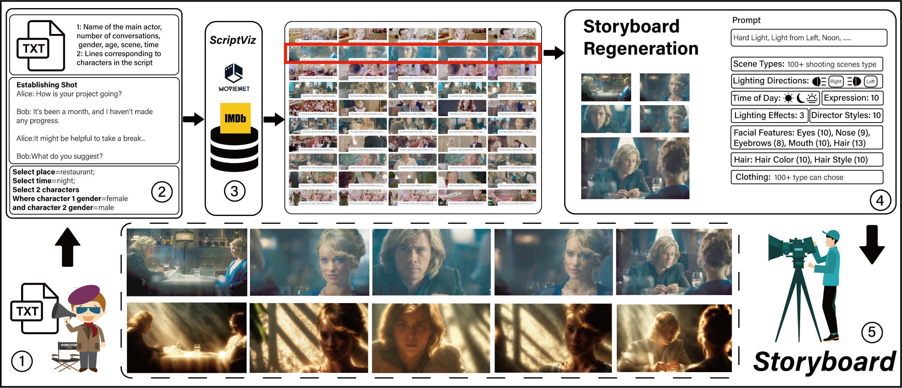
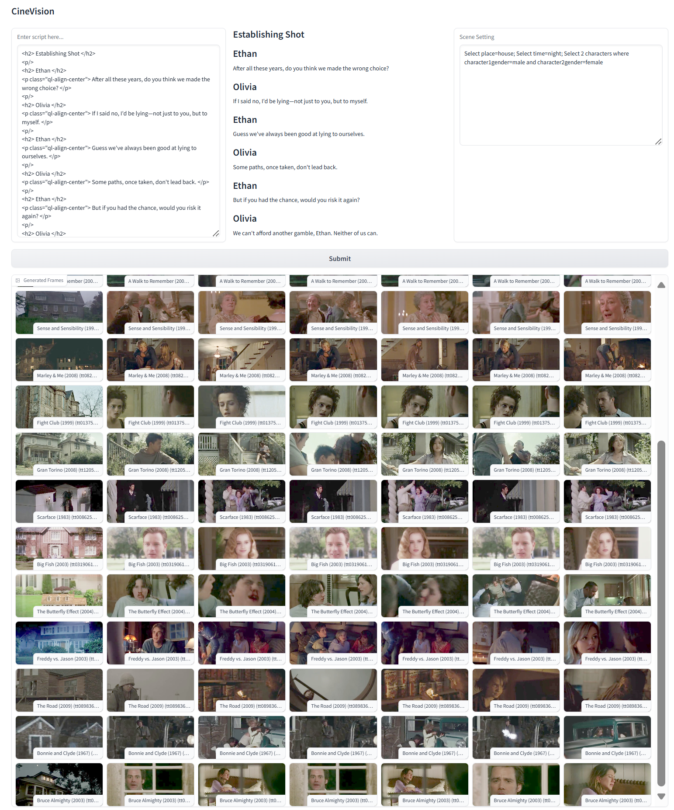
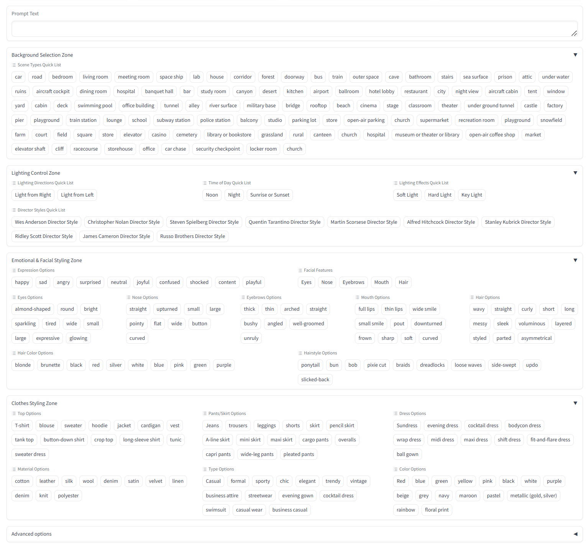
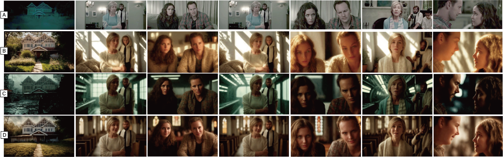

  <!-- <h1> :movie_camera: CineVision (UIST 25)</h1> -->
  <h2> An Interactive Pre-visualization Storyboard System for Director–Cinematographer Collaboration </h2>

Zheng Wei&#42;, Hongtao Wu&#42;, lvmin Zhang, Xian Xu, Yefeng Zheng, Pan Hui, Maneesh Agrawala, Huamin Qu, Anyi Rao:email:

This repository is the official implementation of the paper titled 'CineVision: An Interactive Pre-visualization Storyboard System for Director–Cinematographer Collaboration'. 

<b>Abstract:</b> <i>

Effective communication between directors and cinematographers is fundamental in film production, yet traditional approaches relying on visual references and hand-drawn storyboards often lack the efficiency and precision necessary during pre-production. We present CineVision, an AI-driven platform that integrates scriptwriting with real-time visual pre-visualization to bridge this communication gap. By offering dynamic lighting control, style emulation based on renowned filmmakers, and customizable character design, CineVision enables directors to convey their creative vision with heightened clarity and rapidly iterate on scene composition. In a 24-participant lab study, CineVision yielded shorter task times and higher usability ratings than two baseline methods, suggesting a potential to ease early-stage communication and accelerate storyboard drafts under controlled conditions. These findings underscore CineVision’s potential to streamline pre-production processes and foster deeper creative synergy among filmmaking teams, particularly for new collaborators.
  
</i>

The code and demo are expected to be released before the conference

### • Framework

### • Demo

### • Result

<h2 id="acknowledgement">🤗 Acknowledgement</h2>

This code is based on [ScriptViz](https://virtualfilmstudio.github.io/projects/scriptviz/) and [IC-Light](https://github.com/lllyasviel/IC-Light). Thank them for their outstanding work. 

<h2 id="license">🎫 License</h2>

This project is released under the MIT license. Please refer to the acknowledged repositories for their licenses.
