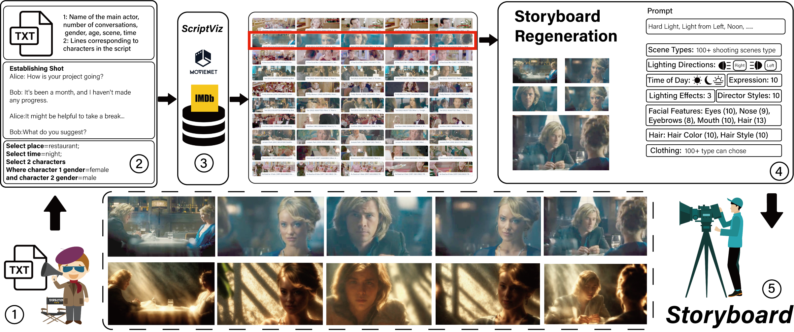

  <h1> :movie_camera: CineVision (UIST 25)</h1>
  <h2> An Interactive Pre-visualization Storyboard System for Director–Cinematographer Collaboration </h2>

Zheng Wei&#42;, Hongtao Wu&#42;, lvmin Zhang, Xian Xu, Yefeng Zheng, Pan Hui, Maneesh Agrawala, Huamin Qu, Anyi Rao:email:

This repository is the official implementation of the paper titled 'CineVision: An Interactive Pre-visualization Storyboard System for Director–Cinematographer Collaboration'. 

The code and demo are expected to be open source before the conference date.

### • Framework

### • Demo

### • Result

